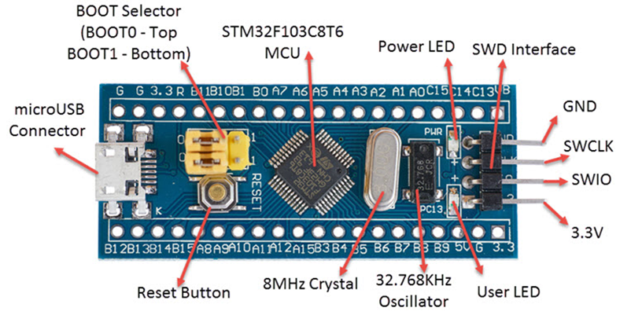
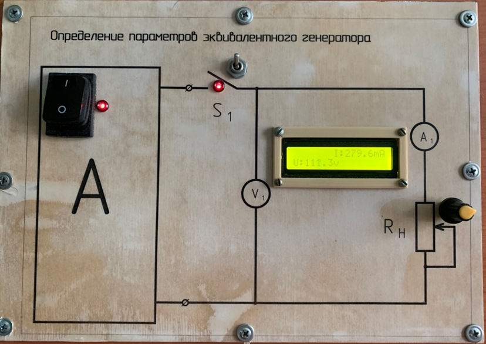
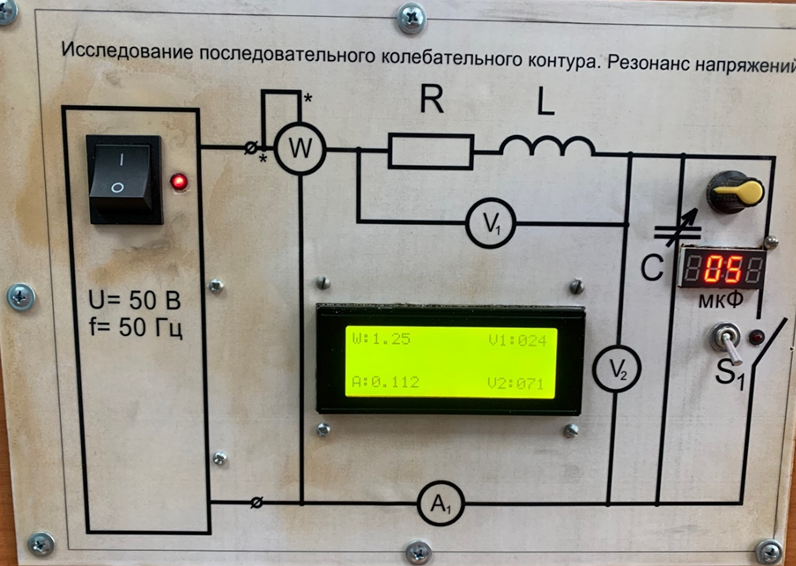
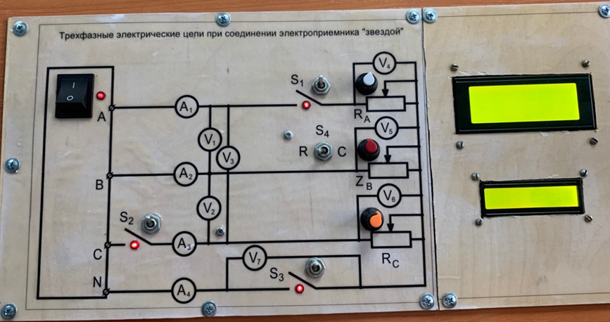
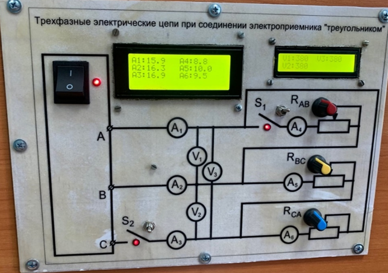
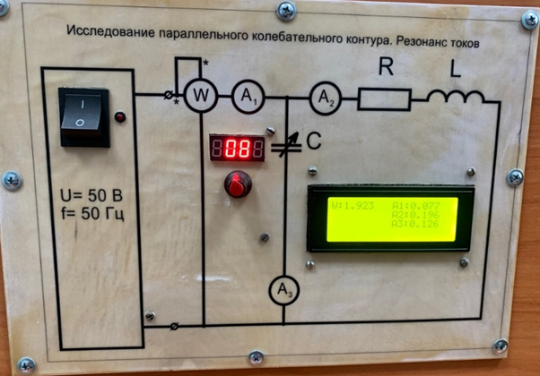

УДК 004.383.4
Дейс Данил Александрович
Доцент
Забайкальский государственный университет
г. Чита, Россия
Пуртов Георгий Андреевич
студент группы ВМК-21 Энергетического факультета
Забайкальский государственный университет
г. Чита, Россия
Кувыкин Никита Денисович
студент группы ВМК-21 Энергетического факультета
Забайкальский государственный университет
г. Чита, Россия
Суворов Данил Максимович
студент группы ВМК-21 Энергетического факультета
Забайкальский государственный университет
г. Чита, Россия
 
 
Разработка компактных современных стендов на базе STM32 для лабораторных работ по дисциплине Электротехника.
В этой статье описывается ход разработки и применения новых компактных современных платформ на базе STM32 для проведения измерительных лабораторных работ по дисциплине Электротехника.
Ключевые слова: STM32, Arduino, Электротехника
 
Одной из актуальных проблем нашего учебного заведения является устаревшее, неремонтопригодное оборудование для проведения лабораторных работ по электротехнике.
Современные технологии позволяют решить данную задачу благодаря мощным и компактным микроконтроллерам, в нашем случае STM32 производства компании STMicroelectronics с прошивкой под среду Arduino. Наш выбор пал на эти микроконтроллеры ввиду низкой стоимости и высокой мощности чипа в своем ценовом сегменте.
Преимуществом нашего варианта решения проблемы по сравнению с ремонтом имеющихся аналоговых стендов является ремонтопригодность, стабильность параметров, электробезопасность и компактность.
​Существенных недостатков нашей разработки не выявлено.

Цель данной работы есть создание современных, технологичных и удобных в разработке и использовании стендов для лабораторно-измерительных работ по дисциплине «Электротехника» и смежных с ней.

Предлагаемое решение базируется на микроконтроллере STM32 Blue Pill STM32F103C8T6[1].

Рис. 1. Схема STM32 Blue Pill STM32F103C8T6

Но, так как оригинальная среда разработки для чипа STM32 не отвечала  нашим требованиям, было принято решение сменить оригинальную прошивку[2] и среду разработки на  среду разработки Arduino[3].

Далее, наш научный руководитель подготовил для нас материал по предметной области с которой нам предстояло работать.

 

 

 

Первым нашим стендом стала установка для л/р (лабораторной работы)  «Определение параметров эквивалентного генератора». Для создания данного симулятора потребовались следующие детали: LCD-экран 16х2, потенциометр и два переключателя. В ходе разработки ПО затруднений не было.

Рис. 2. Стенд №1.

​Второй разработкой стал стенд для л/р «Исследование последовательного колебательного контура. Резонанс напряжений».
В ходе проработки программной и аппаратной части возникали нюансы. Например, экспериментальным путем было выявлено, что библиотека для работы с LCD-экранами по I2C шине даёт высокие временные задержки, что негативно отразилось на работе динамической индикации четырехразрядного семисегментного индикатора. Решением данной проблемы стало внедрение модуля TM1632 – семисегментного четырехразрядного индикатора с шиной I2C.

 

Рис. 3. Стенд №2.

​Третьей разработкой стал стенд для л/р «Трехфазные электрические цепи при соединении электроприемника ”звездой”».
В ходе работы был создан и запрограммирован собственный класс комплексных чисел для вычислений в предметной области переменного тока. Для аппаратной части было задействованы дисплеи LCD 16x2 и 20x4; переключатели в количестве 5 штук, потенциометры в количестве 3 штук.

Рис. 4. Стенд №3

​Четвертой разработкой стал стенд для л/р «Трехфазные электрические цепи при соединении электроприемника ”треугольником”». В ходе работы успешно применен разработанный нами класс комплексных чисел для вычислений значений комплексного тока. Аппаратная часть потребовала дисплеи LCD 16x2 и 20x4; переключатели в количестве 3 штук, потенциометры в количестве 3 штук.

Рис. 5. Стенд №4

Последним является стенд для л/р «Исследование параллельного колебательного контура. Резонанс токов».

Рис. 6. Стенд №5.

Для реализации аппаратной части потребовались: LCD-экран 20х4, переключатель, модуль TM1632, потенциометр. 

​Также следует отметить, что разработка программной части велась с применением системы контроля версий Git[4], а симуляция и разработка прототипов – с помощью ресурса Wokwi[5].

​

Таким образом, мы за период одного учебного семестра сумели спроектировать и внедрить в учебный процесс новые компактные и технологичные решения. На момент написания статьи, наши стенды активно используются студентами ЗабГУ для снятия замеров и защиты лабораторных работ.

 

Список литературы:
1. Спецификация микроконтроллера STM32 [Электронный ресурс] //URL https://stm32-base.org/boards/STM32F103C8T6-Blue-Pill.html (дата обращения 26.02.2023)
2. Репозиторий неофициальной прошивки сообщества [Электронный ресурс] //URL https://github.com/rogerclarkmelbourne/Arduino_STM32 (дата обращения 26.02.2023)
3. Программная документация Arduino [Электронный ресурс] //URL https://www.arduino.cc/en/main/docs (дата обращения 27.02.2023)
4. Репозиторий с исходным кодом программ. [Электронный ресурс]//URL https://github.com/gingerswaltz/ARDUINO (дата обращения 27.02.2023)
5. Веб-ресурс симуляции проектов на базе Arduino и т.п. [Электронный ресурс]//URL https://wokwi.com/ (дата обращения 15.04.2023)